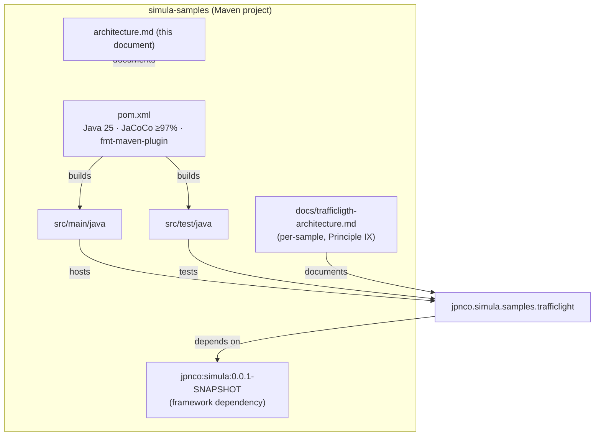
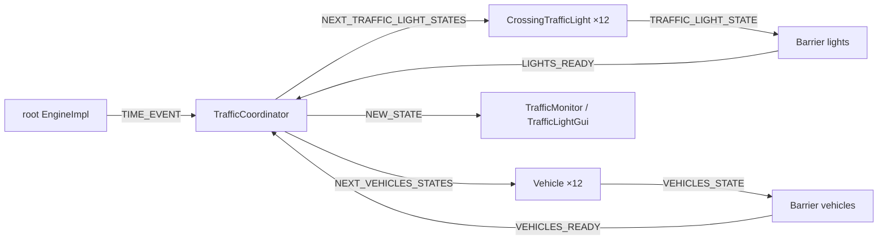

# System Architecture: simula-samples

Architecture of the `simula-samples` project, a Maven workspace that hosts runnable samples for
the **simula** actor-based simulation framework. Each sample is a self-contained deliverable under
the `jpnco.simula.samples` package and MUST satisfy the project constitution's 97% line and branch
coverage gate (Principle II).

The only sample currently shipped is the **traffic-light grid** under
`jpnco.simula.samples.trafficlight`. Its detailed, per-sample architecture is maintained in
[`docs/trafficligth-architecture.md`](./docs/trafficligth-architecture.md) per Constitution
Principle IX; this document describes the project as a whole and how the sample fits into it.

---

## 1. Purpose

`simula-samples` provides demonstration code that illustrates how to model a domain with the
simula framework's actor model. It demonstrates:

- a runnable, deterministic simulation driven by actors and events;
- two display styles (console and Swing) of the same scenario;
- two execution modes (`VIRTUAL` virtual threads and `PLATFORM` classic threads) that produce an
  identical outcome.

The samples are not part of the framework contract; they are separate deliverables that exercise
the framework's **core** API (`jpnco.simula.*`) and must not depend on the framework's `examples`
package (self-containment, Constitution Principle IX).

---

## 2. Scope & Constraints

| Item | Value |
|------|-------|
| Build tool | Maven (`pom.xml`), Java 25 (`maven.compiler.source`/`target` 25) |
| Framework dependency | `jpnco:simula:0.0.1-SNAPSHOT` (installed in the local `.m2`) |
| Test stack | JUnit Jupiter 5.14 + Mockito 5.22 (test scope), Surefire |
| Coverage gate | JaCoCo ≥97% line **and** branch (no sample exemption) |
| Formatter | `fmt-maven-plugin` (google-java-format) enforced on `verify` |
| Samples | `jpnco.simula.samples.trafficlight` (the only sample) |
| Per-sample docs | `docs/trafficligth-architecture.md` |

---

## 3. Component / Package Structure

The traffic-light sample is further split into `actors` and `states` sub-packages; see
[`docs/trafficligth-architecture.md`](./docs/trafficligth-architecture.md) for that detail.

---

## 4. Sample Overview: Traffic-Light Grid

The sample models a bounded 3×3 grid of intersections with a traffic light at every non-corner
intersection and a fixed fleet of 12 vehicles that circulate until the demo stops. It is runnable
in console mode (default) or GUI mode, under either execution mode, with a fixed seed so every run
is reproducible.

The full actor/topic/sequence model, movement rules, determinism, and thread-safety model are
described in the per-sample architecture document
[`docs/trafficligth-architecture.md`](./docs/trafficligth-architecture.md).

---

## 5. Key Decisions

| Decision | Rationale |
|----------|-----------|
| Sample depends only on the framework **core** API | Keeps each sample self-contained (Constitution IX); no coupling to the framework's `examples` package |
| Fixed `RANDOM_SEED` for all randomness | Reproducible runs; identical outcome across `VIRTUAL` and `PLATFORM` modes (FR-008, FR-009, SC-003) |
| Two `Barrier` actors synchronize report grouping | Delegates the "all lights / all vehicles reported" condition to the framework's `Barrier`, replacing manual counters in the coordinator |
| JaCoCo ≥97% line and branch gate | Constitution Principle II applies to every sample deliverable |
| `fmt-maven-plugin` enforced on `verify` | Constitution Principle V (automated formatting) |

---

## 6. Related Documents

- `docs/trafficligth-architecture.md` — per-sample architecture (Mermaid, no history).
- `.specify/memory/constitution.md` — the governing project constitution.
- `specs/001-trafficlight/` — the feature specification, plan, and task list for the sample.
