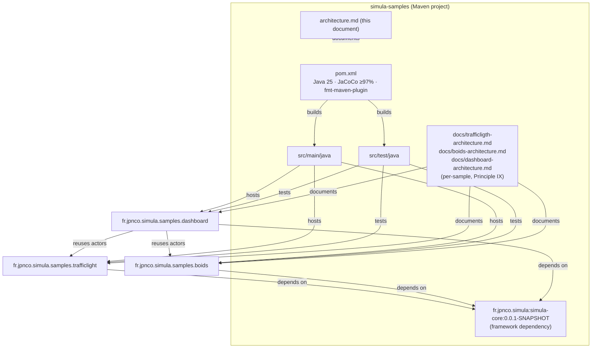
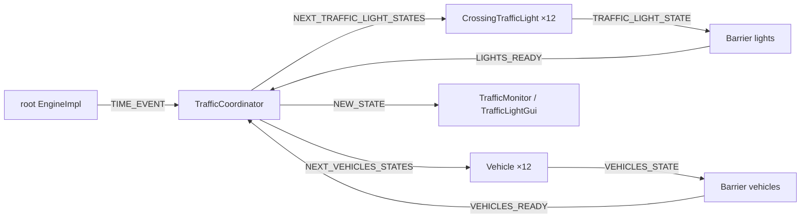
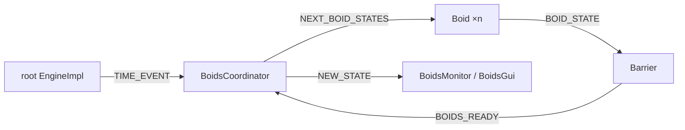
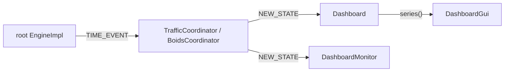

# System Architecture: simula-samples

Architecture of the `simula-samples` project, a Maven workspace that hosts runnable samples for
the **simula** actor-based simulation framework. Each sample is a self-contained deliverable under
the `fr.jpnco.simula.samples` package and MUST satisfy the project constitution's 97% line and branch
coverage gate (Principle II).

Three samples are currently shipped: the **traffic-light grid** under
`fr.jpnco.simula.samples.trafficlight`, the **boids flocking** sample under
`fr.jpnco.simula.samples.boids`, and the **dashboard** sample under
`fr.jpnco.simula.samples.dashboard`. Their detailed, per-sample architectures are maintained in
[`docs/trafficligth-architecture.md`](./docs/trafficligth-architecture.md),
[`docs/boids-architecture.md`](./docs/boids-architecture.md) and
[`docs/dashboard-architecture.md`](./docs/dashboard-architecture.md) per Constitution Principle IX;
this document describes the project as a whole and how the samples fit into it.

---

## 1. Purpose

`simula-samples` provides demonstration code that illustrates how to model a domain with the
simula framework's actor model. It demonstrates:

- a runnable, deterministic simulation driven by actors and events;
- two display styles (console and Swing) of the same scenario;
- two execution modes (`VIRTUAL` virtual threads and `PLATFORM` classic threads) that produce an
  identical outcome.

The samples are not part of the framework contract; they are separate deliverables that exercise
the framework's **core** API (`fr.jpnco.simula.*`) and must not depend on the framework's `examples`
package (self-containment, Constitution Principle IX).

---

## 2. Scope & Constraints

| Item | Value |
|------|-------|
| Build tool | Maven (`pom.xml`), Java 25 (`maven.compiler.source`/`target` 25) |
| Framework dependency | `fr.jpnco.simula:simula-core:0.0.1-SNAPSHOT` (installed in the local `.m2`) |
| Test stack | JUnit Jupiter 5.14 + Mockito 5.22 (test scope), Surefire |
| Coverage gate | JaCoCo ≥97% line **and** branch (no sample exemption) |
| Formatter | `fmt-maven-plugin` (google-java-format) enforced on `verify` |
| Samples | `fr.jpnco.simula.samples.trafficlight`, `fr.jpnco.simula.samples.boids`, `fr.jpnco.simula.samples.dashboard` |
| Per-sample docs | `docs/trafficligth-architecture.md`, `docs/boids-architecture.md`, `docs/dashboard-architecture.md` |

---

## 3. Component / Package Structure

The traffic-light sample is split into `actors` and `states` sub-packages; see
[`docs/trafficligth-architecture.md`](./docs/trafficligth-architecture.md) for that detail. The
boids sample follows the same pattern; see [`docs/boids-architecture.md`](./docs/boids-architecture.md).
The dashboard sample adds an observer over those samples; see
[`docs/dashboard-architecture.md`](./docs/dashboard-architecture.md).

---

## 4. Sample Overview: Traffic-Light Grid

The sample models a bounded 3×3 grid of intersections with a traffic light at every non-corner
intersection and a fixed fleet of 12 vehicles that circulate until the demo stops. It is runnable
in console mode (default) or GUI mode, under either execution mode, with a fixed seed so every run
is reproducible.

The full actor/topic/sequence model, movement rules, determinism, and thread-safety model are
described in the per-sample architecture document
[`docs/trafficligth-architecture.md`](./docs/trafficligth-architecture.md).

---

## 5. Sample Overview: Boids Flocking

The boids sample models a bounded, toroidal 2D world containing a fixed flock of autonomous boid
agents that move by the classic Reynolds flocking rules (separation, alignment, cohesion) against
their neighbours within a perception radius. It is runnable in console mode (default) or GUI mode,
under either execution mode, with a fixed seed and configurable parameters (`--boids=`,
`--perception-radius=`, `--max-speed=`) so every run is reproducible.

The full actor/topic model, the pure `BoidModel` rules, determinism, and thread-safety model are
described in the per-sample architecture document
[`docs/boids-architecture.md`](./docs/boids-architecture.md).

---

## 6. Sample Overview: Dashboard

The dashboard sample attaches to an existing simulation (the traffic-light or boids sample) as an
external observer and collects a time series from its `new-state` events — one sample per tick,
keyed by the simulated time of each immutable snapshot. It is runnable in console mode (default) or
GUI mode, under either execution mode, and can export the collected series to a CSV file. It works
with either target sample without modification.

The full actor/topic model, the sampling logic, thread-safety, and export format are described in
the per-sample architecture document [`docs/dashboard-architecture.md`](./docs/dashboard-architecture.md).

---

## 7. Key Decisions

| Decision | Rationale |
|----------|-----------|
| Sample depends only on the framework **core** API | Keeps each sample self-contained (Constitution IX); no coupling to the framework's `examples` package |
| Fixed `RANDOM_SEED` for all randomness | Reproducible runs; identical outcome across `VIRTUAL` and `PLATFORM` modes (FR-008, FR-009, SC-003) |
| Two `Barrier` actors synchronize report grouping | Delegates the "all lights / all vehicles reported" condition to the framework's `Barrier`, replacing manual counters in the coordinator |
| Boids: one `Barrier` + pure `BoidModel` | The boids sample reuses the same `Barrier`-driven grouping and isolates the flocking rules in a pure, testable `BoidModel` to reach the coverage gate |
| Dashboard: observer actor over `new-state` | The dashboard subscribes to the existing `new-state` topic of a target sample, so it attaches to either the traffic-light or boids sample without modification; it does not rely on a `SimulaSupervisor` (which is not in the framework) and does not modify the target |
| JaCoCo ≥97% line and branch gate | Constitution Principle II applies to every sample deliverable |
| `fmt-maven-plugin` enforced on `verify` | Constitution Principle V (automated formatting) |

---

## 8. Related Documents

- `docs/trafficligth-architecture.md` — traffic-light sample architecture (Mermaid, no history).
- `docs/boids-architecture.md` — boids sample architecture (Mermaid, no history).
- `docs/dashboard-architecture.md` — dashboard sample architecture (Mermaid, no history).
- `.specify/memory/constitution.md` — the governing project constitution.
- `specs/001-trafficlight/`, `specs/002-boids/` and `specs/003-dashboard/` — the feature specifications, plans, and task lists for the samples.
