# Architecture: Boids Flocking Sample

Architecture of the `jpnco.simula.samples.boids` sample, a runnable illustration of the simula
framework with a large population of autonomous agents. It models a bounded, toroidal 2D world of
boid agents that move by the classic Reynolds flocking rules (separation, alignment, cohesion)
until the console run stops, and can be rendered in a Swing window.

This document reflects the current architecture only (Constitution Principle IX): no historical
information. All structural diagrams are Mermaid.

| Item | Value |
|------|-------|
| Base package | `jpnco.simula.samples.boids` |
| Entry point | `BoidsDemo` (`main`) |
| Depends on | framework **core** API (`jpnco.simula.*`), not the framework's `examples` |
| Execution modes | `ExecutionMode.VIRTUAL` (default) / `PLATFORM` (`classic`) |
| Determinism | fixed `RANDOM_SEED`; identical outcome across modes |
| Coverage | JaCoCo ≥97% line and branch (Principle II) |

## Packages

```text
jpnco/simula/samples/boids/
├── BoidsDemo.java        # runnable entry point (main)
├── BoidsCli.java         # command-line parsing (mode, display, parameters)
├── FlockParameters.java  # immutable, configurable flocking parameters
├── actors/
│   ├── Topics.java
│   ├── BoidsCoordinator.java
│   ├── Boid.java
│   ├── BoidsMonitor.java
│   └── BoidsGui.java
└── states/
    ├── BoidModel.java    # pure Reynolds flocking rules
    ├── FlockState.java   # immutable snapshot
    ├── BoidView.java     # immutable read-only boid view
    └── BoidState.java    # immutable per-tick boid report
```

## Actors & Responsibilities

| Actor | Role |
|-------|------|
| `BoidsCoordinator` | Owns the flock, pilots the ticks, assembles `FlockState` snapshots, tracks total distance, stops at the duration |
| `Boid` | Autonomous agent; applies the flocking rules to its position/velocity each tick and broadcasts its state |
| `BoidsMonitor` | Console display; prints each `FlockState` |
| `BoidsGui` | Swing window; renders the flock and repaints at a fixed cadence |
| `Barrier` (framework) | Synchronizes the per-tick boid reports, firing `boids-ready` when all boids reported |

## Event Topics

| Topic | Publisher → Consumer | Payload |
|-------|----------------------|---------|
| `TIME_EVENT` | root engine → coordinator | tick (engine built-in) |
| `next-boid-states` | coordinator → each boid | tick, previous-tick `FlockState` |
| `boid-state` | each boid → `Barrier` | `BoidState` |
| `boids-ready` | `Barrier` → coordinator | (none) |
| `new-state` | coordinator → displays | `FlockState` |

## Tick Flow

```mermaid
sequenceDiagram
    participant E as root EngineImpl
    participant C as BoidsCoordinator
    participant B as Boid ×n
    participant R as Barrier
    participant D as BoidsMonitor / BoidsGui

    E->>C: TIME_EVENT
    C->>B: next-boid-states (tick, previous FlockState)
    B->>B: nextVelocity(separation/alignment/cohesion) + limitSpeed
    B->>B: x+=vx, y+=vy (dt=1); wrap around toroidal world
    B->>R: boid-state (BoidState)
    R->>C: boids-ready (once all n reported)
    C->>C: assemble FlockState; accumulate totalDistance
    C->>D: new-state (FlockState)
    C->>E: stop (when simTime >= duration)
```

The coordinator does not count reports manually: it delegates the "all boids reported" condition to a
simula `Barrier` actor in `CYCLIC` mode with distinct-source counting. Once the coordinator has seen
`boids-ready` it pulls each boid's last-reported state (each boid stores its state before
broadcasting) and assembles an immutable `FlockState`.

## Flocking Rules (BoidModel)

`BoidModel` is a pure, stateless class: every method is deterministic and unit-testable. The world
is toroidal — neighbour distances are computed on the toroidal surface and `wrap` keeps positions
inside `[0, extent)`.

```mermaid
flowchart LR
    V["current velocity vx,vy"] --> N
    S["separation (push away from close neighbours)"] --> N
    A["alignment (steer toward average neighbour velocity)"] --> N
    C["cohesion (steer toward average neighbour position)"] --> N
    N["weighted sum + limitSpeed(maxSpeed)"] --> POS["x+=vx, y+=vy (dt=1)"]
    POS --> W["wrap around toroidal world"]
```



A boid with no neighbours within its perception radius applies no social rule and coasts at its
current velocity. When a boid exactly overlaps a neighbour, separation applies a fixed push so the
boids do not stack permanently.

## Determinism

All randomness (initial placement and velocity of the boids) is seeded from a fixed `RANDOM_SEED` in
`BoidsCoordinator.seed()`. Each boid decides on the **previous tick's** flock state, so movement
does not depend on report arrival order. The same scenario therefore yields an identical final
outcome (boid count and total distance) under `VIRTUAL` and `PLATFORM` modes.

## Thread-Safety

Actors hold only their own private state and exchange immutable report objects over events. The
coordinator owns the mutable `totalDistance` and the boid list on its own thread; each boid's stored
`lastState` is written on its own thread before the report is broadcast. `FlockState` is an
immutable snapshot read safely by the displays.

## CLI

`BoidsDemo [mode] [display] [parameters...]`:

- `mode`: `virtual` (default) or `classic`.
- `display`: `console` (default) or `gui`.
- `parameters`: `--boids=<n>`, `--perception-radius=<n>`, `--max-speed=<n>`.

Unknown tokens are ignored. On completion the console run prints:

```text
=== OUTCOME (<mode>) ===
boids=<n>, distance=<m>
```

## Related Documents

- `architecture.md` — project-wide architecture (Principle VIII).
- `.specify/memory/constitution.md` — the governing project constitution.
- `specs/002-boids/` — the feature specification, plan, and task list for the sample.
