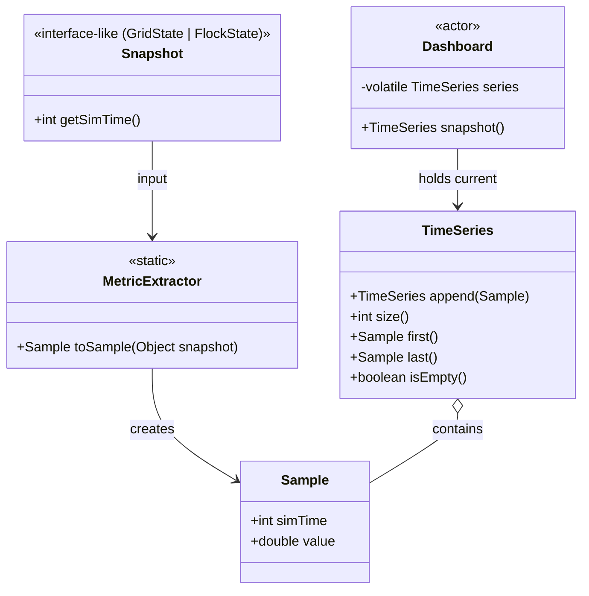

# Architecture: Dashboard Simula Sample

Architecture of the `fr.jpnco.simula.samples.dashboard` sample, a runnable illustration of the simula
framework: a dashboard that attaches to an existing simulation (the traffic-light or boids sample)
as an external observer and collects a time series from its `new-state` events — one sample per
tick, keyed by the simulated time of each immutable snapshot. The collected series is presented
through a console summary, a Swing plot, or an optional CSV export.

This document reflects the current architecture only (Constitution Principle IX): no historical
information. All structural diagrams are Mermaid.

| Item | Value |
|------|-------|
| Base package | `fr.jpnco.simula.samples.dashboard` |
| Entry point | `DashboardDemo` (`main`) |
| Depends on | framework **core** API (`fr.jpnco.simula.*`) and the existing `trafficlight`/`boids` sample actors (same project), not the framework's `examples` |
| Attaches to | `new-state` topic of a target simulation (traffic-light or boids) |
| Execution modes | `ExecutionMode.VIRTUAL` (default) / `PLATFORM` (`classic`) |
| Coverage | JaCoCo ≥97% line and branch (Principle II); `DashboardDemo`/`DashboardGui` excluded |

## Packages

```text
fr/jpnco/simula/samples/dashboard/
├── DashboardDemo.java        # runnable entry point (main)
├── DashboardCli.java         # command-line parsing (target, mode, display, export)
├── DashboardParameters.java  # immutable run configuration
├── actors/
│   ├── Topics.java           # the new-state topic the dashboard subscribes to
│   ├── Dashboard.java        # observer actor: collects the time series
│   ├── DashboardMonitor.java # console display (per-tick line + summary)
│   └── DashboardGui.java     # Swing plot of the series
├── model/
│   ├── Sample.java           # immutable time-series record (simTime, value)
│   ├── TimeSeries.java       # immutable append-only series
│   └── MetricExtractor.java  # maps a snapshot (GridState/FlockState) to a Sample
└── export/
    └── CsvExporter.java      # writes the series to a CSV file
```

## Components & Responsibilities

| Component | Role |
|-----------|------|
| `DashboardDemo` | Builds the selected target simulation on its own root engine, attaches the `Dashboard` (and monitor/GUI), runs console or GUI, prints the summary and exports if requested |
| `DashboardCli` | Parses `target`, `mode`, `display` and `export=<path>` from the command line |
| `DashboardParameters` | Immutable configuration (target, mode, display, optional export path) |
| `Dashboard` | Observer actor that subscribes to `new-state`, converts each snapshot into a `Sample` via `MetricExtractor`, and appends it to its `TimeSeries` |
| `DashboardMonitor` | Console display actor; prints a per-tick line and, at the end, the summary |
| `DashboardGui` | Swing window; plots the collected series, repaints at a fixed cadence |
| `MetricExtractor` | The single point mapping a snapshot to a `Sample` (vehicle count for `GridState`, boid count for `FlockState`) |
| `TimeSeries` / `Sample` | Immutable data model of the collected series |

## Event Topic

The dashboard is an external observer: it publishes no topic and subscribes to the existing
`new-state` topic, which is identical (`"new-state"`) for both target samples.

| Topic | Publisher → Consumer | Payload |
|-------|----------------------|---------|
| `new-state` | `TrafficCoordinator` / `BoidsCoordinator` → `Dashboard`, `DashboardMonitor`, `DashboardGui` | `GridState` / `FlockState` |

## Data Model



## Collection Flow

```mermaid
sequenceDiagram
    participant E as root EngineImpl
    participant C as TrafficCoordinator / BoidsCoordinator
    participant D as Dashboard
    participant M as DashboardMonitor
    participant G as DashboardGui

    E->>C: TIME_EVENT (per simulated second)
    C->>C: assemble immutable snapshot (GridState/FlockState)
    C->>D: new-state (snapshot)
    D->>D: MetricExtractor.toSample(snapshot); series = series.append(sample)
    C->>M: new-state (snapshot)
    M->>M: print per-tick line
    D->>G: reads series() on each 100 ms repaint
```

The dashboard does not modify the target simulation: it subscribes to `new-state` on the same root
engine and only records the payload. Both `GridState` and `FlockState` expose `getSimTime()` and an
aggregate count, so the same dashboard works for either target without modification.

## Sampling & Determinism

One sample is recorded per received `new-state` event (one per tick). `simTime` is taken from the
snapshot itself, so no separate clock is needed and the recorded series is deterministic given the
target simulation's fixed seed. The `TimeSeries` grows monotonically by one sample per tick; an
empty run (no `new-state`) leaves the series empty, which the sample reports rather than fails.

## Thread-Safety

The `Dashboard` actor writes its `volatile TimeSeries` field on its own event-loop thread and
exposes it via `snapshot()`; the console monitor, the GUI (on the EDT) and the exporter read that
snapshot safely. `Sample` and `TimeSeries` are immutable, and the snapshots received on `new-state`
are already immutable.

## GUI Rendering

`DashboardGui` is a Swing window that is itself an `Actor`: it subscribes to `new-state` and a
`Timer` (100 ms) repaints the plot on the Event Dispatch Thread. The plot reads the collected series
from the attached `Dashboard` via `series()`, so it reflects the latest samples as they are
recorded. The status line shows the current sample count and the latest simulated time.

## Export

`CsvExporter` writes the collected series to a file: a header line `simTime,value` followed by one
`simTime,value` line per recorded sample. An empty series writes only the header, so the export is
never malformed (the sample reports "nothing was exported").

## CLI

`DashboardDemo [target] [mode] [display] [export=<path>]`:

- `target`: `boids` (default) or `trafficlight`.
- `mode`: `virtual` (default) or `classic`.
- `display`: `console` (default) or `gui`.
- `export=<path>`: writes the collected series to the file (optional).

Unknown tokens are ignored. On completion the console run prints a summary:

```text
samples=<n>, first=<simTime0>, last=<simTimeN>
```

## Related Documents

- `architecture.md` — project-wide architecture (Principle VIII).
- `.specify/memory/constitution.md` — the governing project constitution.
- `specs/003-dashboard/` — the feature specification, plan, and task list for the sample.
