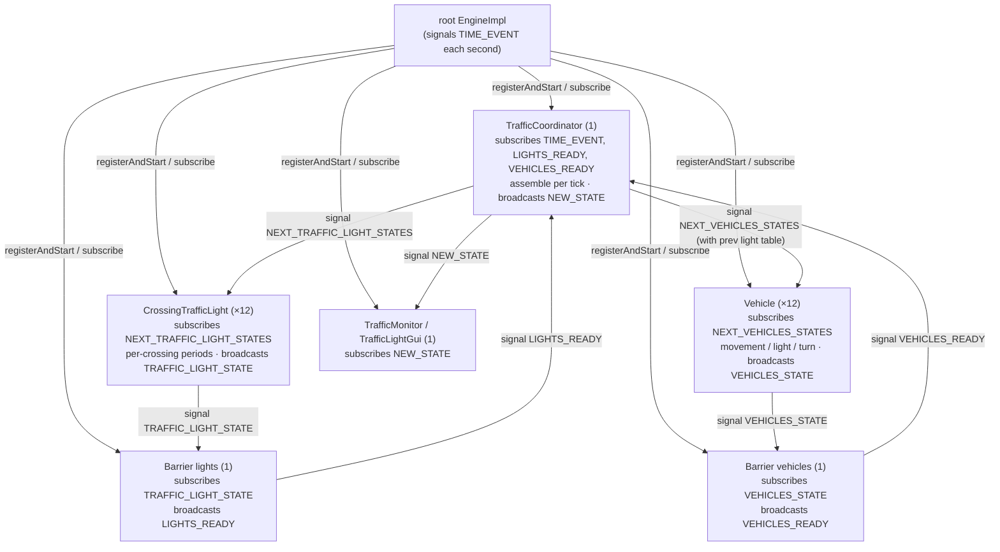

# Sample Architecture: Traffic-Light Grid

Architecture of the `fr.jpnco.simula.samples.trafficlight` sample, a runnable illustration of the simula framework. It models a closed grid of roads with a traffic light at each intersection and a fleet of vehicles that circulate for a fixed number of simulated seconds.

This document describes the **current** architecture in which the vehicles, the traffic lights and the coordinator are all autonomous actors that cooperate exclusively by broadcasting events. It is demonstration code under the `samples` package: it is not part of the framework contract, but per the project constitution it is a deliverable that MUST satisfy the 97% line and branch coverage gate (Principle II), with the runnable entry point and Swing rendering glue excluded from the JaCoCo instrumentation.

---

## 1. Purpose & Scenario

The sample demonstrates the framework's actor model with a concrete, self-contained simulation:

- A **3 × 3 grid of cells** (blocks) bounded by **4 × 4 roads**, with an intersection at every crossing (**16 intersections**).
- A **traffic light actor per non-corner intersection** whose two bands (north-south and east-west) alternate; the **four corners** have no crossing traffic and are always green (no light).
- A **fixed fleet of 12 vehicle actors** that travel the roads, respect the lights, may turn at intersections, and keep circulating (a vehicle on an edge must turn rather than leave the grid).
- The same scenario can be run under `ExecutionMode.VIRTUAL` (default, virtual threads) or `ExecutionMode.PLATFORM` (classic threads) and produces the **same outcome** in both (SC-003 behavioral equivalence).

---

## 2. Scope & Constraints

| Item | Value |
|------|-------|
| Base package | `fr.jpnco.simula.samples.trafficlight` |
| Sub-packages | `…trafficlight.actors`, `…trafficlight.states` |
| Coverage gate | Applied at ≥97% line and branch (JaCoCo excludes runnable/GUI glue) |
| Contract | Not part of the framework contract |
| Entry point | `TrafficLightDemo` (`main`, root package) |
| Reproducibility | Fixed `RANDOM_SEED`; same outcome in both execution modes |

The sample uses the framework's **delegate pattern**: each actor implements `Actor`, holds an `ActorDelegate.createDelegate(engine, this)`, and exposes the three required methods (`getDelegate()`, `getId()`, `process(Event)`).

### Package layout

```text
fr/jpnco/simula/samples/trafficlight/
├── TrafficLightDemo.java        # runnable entry point (main) — not an actor
├── TrafficLightCli.java         # CLI argument parsing (mode + display) — not an actor
├── actors/
│   ├── Topics.java              # event topic constants
│   ├── TrafficCoordinator.java  # orchestrator actor (assemble + broadcast)
│   ├── CrossingTrafficLight.java# one actor per light intersection (×12)
│   ├── Vehicle.java             # autonomous vehicle actor (×12)
│   ├── TrafficMonitor.java      # console display actor
│   ├── TrafficLightGui.java     # Swing display actor
│   ├── GridGeometry.java        # pixel layout metrics for the GUI
│   ├── LightColors.java         # LightState → Color mapping for the GUI
│   └── MonitorRenderer.java     # GridState → console text rendering
└── states/
    ├── GridState.java           # immutable snapshot broadcast on NEW_STATE
    ├── VehicleView.java         # immutable view of one vehicle
    ├── VehicleState.java        # vehicle report broadcast on VEHICLES_STATE
    ├── TrafficLightState.java   # light report broadcast on TRAFFIC_LIGHT_STATE
    ├── LightState.java          # enum GREEN / ORANGE / RED
    └── Direction.java           # enum NORTH / SOUTH / EAST / WEST
```

---

## 3. Runtime Topology



All actors live on the **same root engine** and interact only by broadcasting events on shared topics — no actor holds a reference to another (broadcast avoids knowing the coordinator).

---

## 4. Component Inventory

### 4.1 Actors (`actors` package)

#### Topics
A holder of the event-topic string constants shared by the actors:

| Topic | Publisher → Consumer | Payload |
|-------|----------------------|---------|
| `NEXT_TRAFFIC_LIGHT_STATES` | Coordinator → lights | tick |
| `NEXT_VEHICLES_STATES` | Coordinator → vehicles | tick, previous-tick light table |
| `TRAFFIC_LIGHT_STATE` | each light → lights `Barrier` | `TrafficLightState` |
| `VEHICLES_STATE` | each vehicle → vehicles `Barrier` | `VehicleState` |
| `LIGHTS_READY` | lights `Barrier` → coordinator | (none) |
| `VEHICLES_READY` | vehicles `Barrier` → coordinator | (none) |
| `NEW_STATE` | coordinator → displays | `GridState` |

#### TrafficCoordinator
The orchestrator actor that owns the fleet, the crossing counters and the light table, creates the two synchronization barriers, and assembles the snapshots.

- **Subscribes**: `TIME_EVENT`, `LIGHTS_READY`, `VEHICLES_READY`.
- **Fields**: `lights` (List\<CrossingTrafficLight\>), `vehicles` (List\<Vehicle\>), `crossings` (int[][]), `simTime`, `lightsReady`/`vehiclesReady` (boolean), `lastLights` (LightState[][][]), `lightsBarrier`/`vehiclesBarrier` (Barrier), `state` (volatile GridState), `done` (CountDownLatch), `totalCrossings`.
- **Responsibilities**:
  - `seed()` creates and starts the 12 light actors and 12 vehicle actors with deterministic seeds, then creates and starts the two `Barrier` actors (in `CYCLIC` mode, distinct-source counting) on `TRAFFIC_LIGHT_STATE`/`VEHICLES_STATE`;
  - on `TIME_EVENT` opens a new tick (§6);
  - on the two completion signals `LIGHTS_READY` and `VEHICLES_READY` pulls each actor's last-reported state and, once **both** groups of the tick have reported, assembles and broadcasts `NEW_STATE`, then stops the engine when the duration is reached.

#### CrossingTrafficLight
An autonomous actor representing the traffic light of one intersection. Each crossing owns its own timing: **green and orange durations and a phase offset are fixed at construction**, so different intersections may have different periods.

- **Subscribes**: `NEXT_TRAFFIC_LIGHT_STATES`.
- On that event it computes its two band states for the tick, stores them as its last state, and broadcasts `TRAFFIC_LIGHT_STATE` (the coordinator pulls the stored state after the barrier fires).
- **Periods**: green duration drawn in [20, 30] s (deterministic per light), orange fixed at 3 s.

#### Vehicle
An autonomous actor representing one vehicle; it contains all of its own movement behavior.

- **Subscribes**: `NEXT_VEHICLES_STATES`.
- On that event it receives the **previous tick's light table**, advances itself (respects the light, chooses its direction), stores its `VehicleState` (position, direction, distance, cells entered), and broadcasts it (the coordinator pulls the stored state after the barrier fires).
- Owns its **own seeded `Random`** (`RANDOM_SEED + id`) for turn decisions.

#### TrafficMonitor
The console display actor: subscribes to `NEW_STATE` and prints the grid to `System.out` (one cell per intersection, light marker + vehicle occupancy), rendered by `MonitorRenderer`.

#### TrafficLightGui
The Swing/Java2D display actor: subscribes to `NEW_STATE`, stores the latest `GridState`, and a `Timer` on the Event Dispatch Thread repaints the panel from it. Layout metrics come from `GridGeometry` and light colors from `LightColors`.

#### GridGeometry, LightColors, MonitorRenderer
Pure helper classes extracted from the rendering code so they are independently testable:
- `GridGeometry` computes the pixel layout of the grid panel from its dimensions.
- `LightColors` maps a `LightState` to the pixel `Color` of a light circle and holds the scene colors.
- `MonitorRenderer` renders a `GridState` as console text.

### 4.2 States (`states` package)

#### GridState (immutable snapshot)
Broadcast on `NEW_STATE` after every completed tick: `simTime`, `vehicles` (List\<VehicleView\>, unmodifiable), `northSouth`/`eastWest` light bands (copies), `crossings` (copy). Read safely from other threads.

#### VehicleView (immutable)
One vehicle's position and direction: `id`, `row`, `col`, `direction`, `distanceInSegment`.

#### VehicleState (immutable report)
Broadcast on `VEHICLES_STATE`: `tick`, `id`, `row`, `col`, `direction`, `distanceInSegment`, and the list of cells the vehicle entered during the tick (for the crossing counters).

#### TrafficLightState (immutable report)
Broadcast on `TRAFFIC_LIGHT_STATE`: `tick`, `row`, `col`, `ns`, `ew`.

#### LightState (enum)
`GREEN`, `ORANGE`, `RED`.

#### Direction (enum)
`NORTH`, `SOUTH`, `EAST`, `WEST` with `(rowDelta, colDelta)`; `isVertical()`, `turnRight()`, `turnLeft()`.

### 4.3 Entry point and CLI

#### TrafficLightDemo
Parses CLI args, builds the root engine, creates and seeds the coordinator, creates the display actor, starts the engine, awaits completion and prints the outcome (`vehicles=…, crossings=…`). Not an actor.

#### TrafficLightCli
Parses the command-line tokens into an execution mode and a display choice so the parsing rules are independently testable.

---

## 5. Grid & Movement Model

### 5.1 Geometry

| Constant | Value | Meaning |
|----------|-------|---------|
| `GRID_SIZE` | 3 | Cells along each side |
| `INTERSECTIONS` | 4 | Roads/intersections along each side |
| `SEGMENT_LENGTH` | 100.0 m | Segment between two intersections |
| `INTERSECTION_HALF` | 5.0 m | Half the crossing width |
| `LIGHT_POSITION` | 95.0 m | Stop line of the next intersection's light |
| `GREEN_SEGMENT_METERS` | 20.0 m | Green segment drawn at an intersection |
| Light green duration | [20, 30] s | Drawn per light (deterministic) |
| Light orange duration | 3 s | Fixed |
| `TURN_PROBABILITY` | 0.25 | Chance to turn at an intersection |
| `INITIAL_VEHICLES` | 12 | Fleet size |
| `RANDOM_SEED` | 20260924L | Determinism seed |

### 5.2 Traffic light

Each non-corner intersection is governed by its own `CrossingTrafficLight` actor, whose two bands (north-south and east-west) alternate on its own cycle: one band is green for its own green duration, orange for 3 s, then the other band takes over. Because each light has its own green duration and a phase offset, different intersections switch at different times (staggered). The four **corner** intersections have no crossing traffic and are always `GREEN`; they have no light actor and the light table leaves them green.

A light's band state at a tick is a **deterministic function** of its own parameters: `phase = floorMod(tick + phaseOffset, cycle)`, `cycle = 2 × (green + orange)`.

### 5.3 Stop rule

A vehicle stops at `LIGHT_POSITION` (95 m) when the light of the intersection it is approaching is not green for the band of its **approach direction**, and waits for green; it does not stop in the middle of the crossing. A vehicle that has already passed the stop line (is committed) clears the intersection.

### 5.4 Direction rule

At an intersection a vehicle can **only** continue straight, turn right or turn left — it can **never** reverse / do a U-turn. On an edge it is forced to turn (in a corner only one side keeps it on the grid); otherwise, with probability `TURN_PROBABILITY`, it picks uniformly among straight/right/left, discarding any choice that would leave the grid.

---

## 6. Tick Interaction (per simulated second)

The simulation is **event-driven**. On each `TIME_EVENT` the coordinator opens a new tick, asks every light and every vehicle to report, collects the reports, and broadcasts the assembled snapshot once all have reported.

```mermaid
sequenceDiagram
    autonumber
    participant C as TrafficCoordinator
    participant L as each CrossingTrafficLight (12)
    participant V as each Vehicle (12)
    participant LB as Barrier lights
    participant VB as Barrier vehicles
    participant D as Display (monitor/gui)

    Note over C: TIME_EVENT received
    C->>C: simTime++; reset ready flags
    C-->>L: signal NEXT_TRAFFIC_LIGHT_STATES (tick)
    C-->>V: signal NEXT_VEHICLES_STATES (tick, prev light table)
    L->>L: compute + store band states for the tick
    L-->>LB: signal TRAFFIC_LIGHT_STATE (TrafficLightState)
    V->>V: advance using prev light table<br/>(respect light / choose direction); store state
    V-->>VB: signal VEHICLES_STATE (VehicleState)
    Note over LB: counts 12 distinct lights
    LB-->>C: signal LIGHTS_READY
    Note over VB: counts 12 distinct vehicles
    VB-->>C: signal VEHICLES_READY
    Note over C: after both LIGHTS_READY AND VEHICLES_READY
    C->>C: pull each light/vehicle last state; assemble GridState
    C-->>D: signal NEW_STATE (GridState)
    C->>C: if simTime ≥ durationSeconds: engine.stop(); done.countDown()
```

Key points:

- **Broadcast, no shared object**: the coordinator signals `NEXT_*` and each actor broadcasts its state back on the corresponding topic; no actor holds another's reference.
- **Barrier-based grouping**: synchronization is delegated to two simula `Barrier` actors (in `CYCLIC` mode, distinct-source counting). The lights `Barrier` fires `LIGHTS_READY` once all 12 lights have reported; the vehicles `Barrier` fires `VEHICLES_READY` once all 12 vehicles have reported. The coordinator assembles and broadcasts `NEW_STATE` only after it has seen **both** completion signals for the tick.
- **Pull on completion**: each light/vehicle stores its state **before** broadcasting it, so when its barrier fires every stored state is current for the tick; the coordinator then pulls each actor's last-reported state rather than collecting the raw reports itself.
- **Previous-tick light table**: vehicles receive the light table of the *previous completed* tick (deterministic and already known), so their decision does not depend on the arrival order of the lights' reports in the current tick.
- **Tick carried for error detection**: every report carries its tick number, used only to detect out-of-order/erroneous events — not for functional grouping (grouping is by barrier).
- **Corners stay green**: the coordinator builds the light table from the pulled reports on top of an all-green table, so the four corner cells (which have no light actor) remain `GREEN`.

---

## 7. Thread-Safety Model

| Concern | Mechanism |
|---------|-----------|
| Report grouping | Two `Barrier` actors count the `TRAFFIC_LIGHT_STATE` and `VEHICLES_STATE` reports (CYCLIC, distinct-source) and signal completion |
| Completion detection | Coordinator's single-threaded event loop (processes its queue sequentially); assembles only after both completion signals |
| Crossing counters | Owned by the coordinator; written from its own thread as it pulls the vehicle states |
| Snapshot publication | `volatile GridState state`; `GridState`/`VehicleView` are immutable and defensively copied |
| Actor internals | Each actor is confined to its own thread (single-threaded event loop); each stores its last state before broadcasting |
| Displays | Read immutable `GridState`; GUI renders on the Event Dispatch Thread |

There is **no shared mutable state** between actors: the vehicles and lights hold only their own private state and exchange immutable report objects over events. The only mutable collections (`crossings`, the light table) belong to and are mutated by the coordinator on its own thread; each light/vehicle's stored last state is written on its own thread before the report is broadcast.

---

## 8. Determinism (SC-003)

- All randomness is seeded: the coordinator seeds spawn positions/directions and each light's green duration from `RANDOM_SEED`; each vehicle is given its own deterministic seed (`RANDOM_SEED + id`).
- Vehicles decide on the **previous tick's light table** (deterministic and known), never on the ordering of asynchronous reports.
- The `NEW_STATE` snapshot is assembled by vehicle id, so its content is deterministic even though reports arrive in any order.
- As a result the same scenario yields the same outcome (`vehicles=…, crossings=…`) in both `VIRTUAL` and `PLATFORM` modes. This is verified by `DeterminismTest`.

---

## 9. Execution Modes & CLI

`TrafficLightDemo [mode] [display]`

- `mode`: `virtual` (default) or `classic` → `ExecutionMode.PLATFORM`.
- `display`: `console` (default) or `gui` → Swing window.

The root engine is created with the chosen mode and `TIME_FACTOR = 1`. The console run lasts `SIMULATED_SECONDS` (120) simulated seconds then stops and prints the outcome; the GUI run continues until the window is closed.
